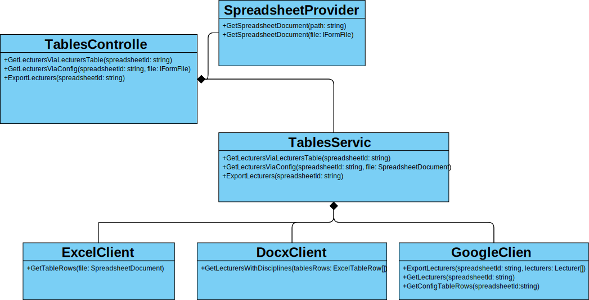

# Архитектура приложения

* Controller 
    - Service
        - Client

`Controller` имеет только экземпляры `Service` (на данный момент он один), а `Service` --
только экземпляры `Client`.  Таким образом, архитектура получилась модульной и шасширяемой.
## Controllers

`TablesController` отвечает на один из трёх сетевых запросов:
* импорт таблицы с преподавателями  при помощи файла с дисциплинами и конфигурационной Google Spreadsheet таблицы
* импорт ранее экспортированной таблицы с преподавателями
* экспорт таблицы с преподавателями

`SpreadsheetProvider` конвертирует файл, присланный
по сети в класс `SpreadsheetDocument` из библиотеки `OpenXml`, а также
 умеет преобразовывать в этот же класс документ из файловой системы, что сильно пригождается при тестировании.

`TablesController` перенаправляет запросы `TablesService`.

`TablesService` имеет экземпляры `ExcelClient`, `DocxClient` и `GoogleClient`.
## Clients
`ExcelClient` преобразовывает в объектно-ориентированные модели 
строки файла с дисциплинами при помощи библиотеки `OpenXml`.

`DocxClient` преобразовывает модели, полученные 
`ExcelClient`, в преподавателей с дисциплинами. У дисциплины имеется код и образовательная программа, на которой она реализуется. Они помогают `Curriculum Parser` открыть 
нужный учебный план среди всех и найти дисциплину по коду со всей необходимой информацией. Было выделено 2 более общих типа учебной работы - `лекции` и `практики`.  `DocxClient` объединяет эти дисциплины для более удобной визуализации
по следующему принципу: в `леции` группируются  
следующие типы учебной работы: `лекции`, `коллоквиумы`, `экзамен` и `консультации`, а в `практики` -- всё остальные типы.

`GoogleClient` умеет
* преобразовывать строки конфигурационной таблицы в объектно-ориентированные модели, при помощи которых
из полученных с помощью DocxClient преподавателей выбираются интересующие, а также им назначается процентная ставка
и должность, которая определяет норматив контактной нагрузки, и после этой фильтрации возвращать  готовую коллекцию преподавателей со всей нужной информацией
клиентской части
* экспортировать преподавателей в Google Spreadsheet таблицу
* преобразовывать обратно в модели преподавателей строки таблицы, экспортированной приложением, и возвращать их клиенту

